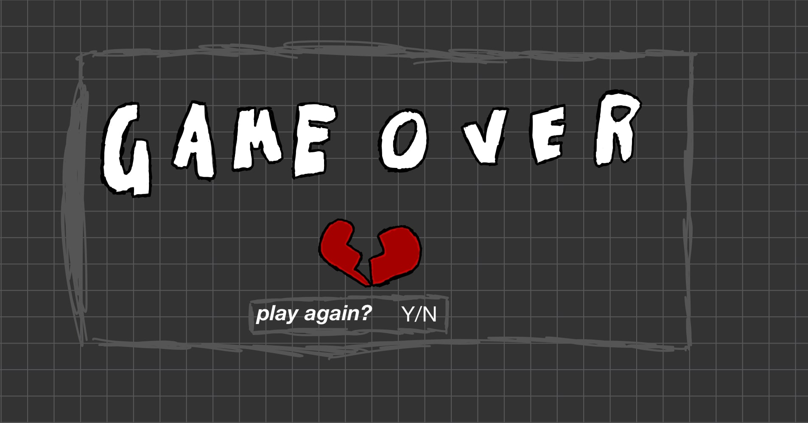

:warning: Everything between << >> needs to be replaced (remove << >> after replacing)
# CS110 Project Proposal
# Shooter game
## CS 110 Final Project
### Spring, 2022
### [Assignment Description](https://docs.google.com/document/d/1H4R6yLL7som1lglyXWZ04RvTp_RvRFCCBn6sqv-82ps/edit#)

[repl link]([#](https://replit.com/join/kmcnkbpwrb-jiarongjin)) 

 [link to demo presentation slides](https://docs.google.com/presentation/d/16JBUZGX5wdl_8uhF4R_C8ngzpFsdlrtzBsWF-zxXzD0/edit?usp=sharing)

### Team: team 22
#### JiaRong Jin, Brian Seo, David Allen

***

## Project Description *(Software Lead)*

A 2D horizontal shooting game. User controlls a player to move around and shoot at enemy. Win by eliminating all enemies.
***    

## User Interface Design *(Front End Specialist)*

* gameover cs110.jpg, in-game cs110.jpg, menu cs110.jpg in etc folder
* * 
* * 
* * 
    * For example, if your program has a start screen, game screen, and game over screen, you should include a wireframe / screenshot / drawing of each one and a short description of the components
  

***        

## Program Design *(Backend Specialist)*

* Non-Standard libraries
  * Pygame https://www.pygame.org/docs/
  * Random https://docs.python.org/3/library/random.html
  * Sys https://docs.python.org/3/library/sys.html

    * For each additional module you should include
        * url for the module documentation
        * a short description of the module
* Class Interface Design
    * 
        * 
    * This does not need to be overly detailed, but should show how your code fits into the Model/View/Controller paradigm.
* Classes
  * Bullet - A class that defines the the bullets that come out of the controlled character and shoots the enemies.
  * Enemy - This class defines the enemy and its random movements.
  * Player - This class defines the bullets actually coming out of the player using the space key.
  * Wall- Creates boundary for the game in prevent enemy from moving out of the screen
  * Controller - A class that defines the abilities of the character and allows the user to be able to control the character using the “wasd” keys to move the character vertically or laterally.Here it is determined if your bullets made contact with the enemy. It is also the place that establishes the background and the screen which shows whether the player won or lost and allows them to either play again or quit the game.

## Project Structure *(Software Lead)*

The Project is broken down into the following file structure:

* main.py
* src
    * bullet.py
    * controller.py
    * enemy.py
    * player.py
    * wall.py
* assets
    * background.png
    * Bullet_drawing.png
    * Enemy_jelly.png
    * enemy.png
    * Player.png
    * player2.png
* etc
    * class_structure_sketch.jpg
    * Final_gui.PNG
    * gameover_cs110.jpg
    * in-game_cs110.jpg
    * menu_cs110.jpg
***

## Tasks and Responsibilities *(Software Lead)*

   * You must outline the team member roles and who was responsible for each class/method, both individual and collaborative.

### Software Lead - JiaRong Jin

Worked as integration specialist by helping organize the code for the main game into the proper MVC format, which allowed all portions of the code to be run from a single file.  worked very closely with the back end to develop the player movement. also lead the implementation of the ‘sprite’ and ‘group’ classes of pygame into the back end code.

### Front End Specialist - David Allen

Front-end lead conducted significant research on using pygame to create visual aspects such as background and on-screen text. He used this information to design and program a consistent UI to help the player navigate the game over screen. In addition to implementing the wide majority of the visual element for the UI, he also collaborated with the Software Lead to have the bullets come out of the player.

### Back End Specialist - Brian Seo

The back end specialist helped with the “Model” portion of the game by writing the major classes that would be used in the main game, as well as implementing major pygame functionality into each of them. He also implemented major game mechanics such as the player and enemy movement. He collaborated with the Front End Specialist in the implementation of the classes into our Controller file.

## Testing *(Software Lead)*

* When we started the game we made sure the player was moving in the the correct direction based on the input that was given. We also needed to see the speed of the character and if it continued moving when the key was held. Next we tested to see if the enemies were moving how we wanted them to. We needed to see of they were spawning randomly and moving towards the player. It was also important to see the speed the enemies were moving at because we didn’t want them to move too fast. 
We then conducted normal play testing to see if the shooting function worked by pressing the space key to see if the bullet would come out. From this we would see if collisions would make the enemy disappear. If the bullet collided with the three enemies we would then see if the “You won!” screen would come up, or if player did not manage to collide the bullet with all enemies before they reach the left side of the screen, Lose screen would come up
We then tested to see if the enemies hit the wall, will the game over screen come up. 
Lastly did final play testing to see if there were any bugs that prohibited the user from playing the game.
## ATP

| Step                  | Procedure     | Expected Results  | Actual Results |
| ----------------------|:-------------:| -----------------:| -------------- |
|  1  | Run controller() |Game menu opens and is functional, Enemy is moving towards player, and Bullet shoots out|          |
|  2  | Press SPACE BAR  | Bullet is shot out, Bullet travels across the screen, If bullet have contact with enemy, enemy dies
 |                 |
3|Press W KEY,hold W KEY|Player moves upward when pressed once, Player continues to move upward when key is held
|
4|Press A KEY,hold A KEY|Player moves left when pressed once, Player continues to move left when key is held|
5|Press S KEY,hold S KEY|Player moves downward when pressed once, Player continues to move downward when key is held|
6|Press D KEY,hold D KEY|Player moves right when pressed once, Player continues to move right when key is held|
7|Click X button on top right corner of the window|The program closes properly|
8|General playtesting|Bullet fly all the way across the screen, When bullet touches the enemy, enemy disappears, Bullet returns to the player and shoots out again when SPACEBAR is pressed, If all enemies were killed, Win screen appears, If enemy touches the player, or touches the left side of the screen, game over screen appears|
9|Attempt to reach win state|Shows Text:You won! Press R to play again. Press Q to exit.Pauses the screen|
10|Press R KEY(Returns to game screen)|Program goes back to game menu, Enemy is moving towards player, Bullet shoots out|
11|Attempt to reach win state|Shows Text:You won! Press R to play again. Press Q to exit.Pauses the screen|
12|Press Q KEY|The program closes properly|
13|Force fail state|Shows Text:You lost! Press R to play again.Press Q to exit.Pauses the screen|
14|Press R KEY(Returns to game screen)|Program goes back to game menu, Enemy is moving towards player, Bullet shoots out\|
15|Force fail state|Shows Text:You lost! Press R to play again.Press Q to exit.Pauses the screen|
16|Press Q KEY|The program closes properly|
17|Avoid touching the enemy, and let the enemy walk towards the left side of the screen.(The game would go into fail state as way to prevent user error.)|Shows Text:You lost! Press R to play again.Press Q to exit.Pauses the screen|